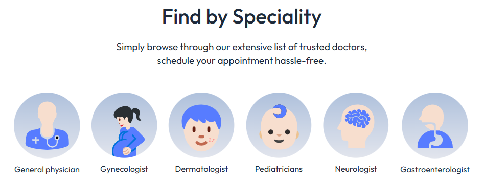
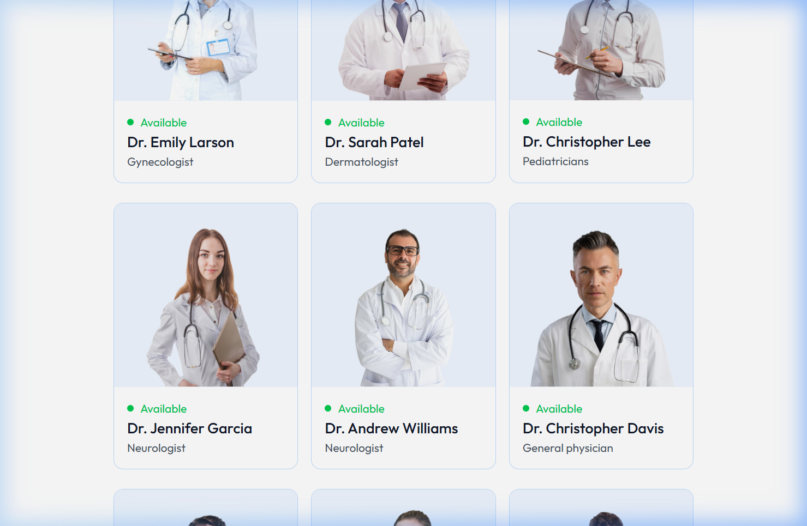
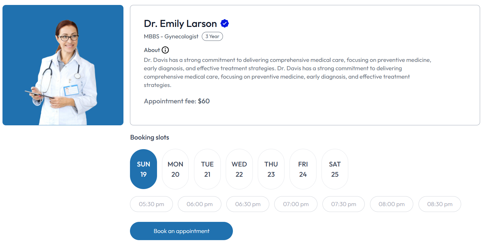
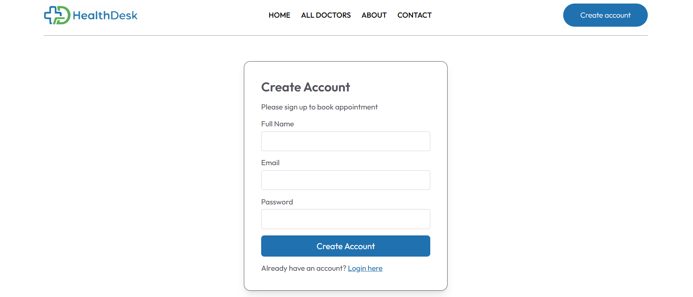

<p align="center">
  
</p>

<h1 align="center">HealthDesk — Doctor Appointment Booking System</h1>

<p align="center">
  <em>A full-stack healthcare appointment management platform built with the MERN stack</em>
</p>

<p align="center">
  <a href="https://healthdesk-9hy6.onrender.com/">
    
  </a>
</p>

<p align="center">
  
  
  
  
  
  
  
</p>

---

## 📋 Table of Contents

- [✨ Overview](#-overview)
- [🚀 Live Demo](#-live-demo)
- [📸 Screenshots](#-screenshots)
- [🏗️ Architecture](#️-architecture)
- [⚙️ Tech Stack](#️-tech-stack)
- [🎯 Features](#-features)
- [📂 Project Structure](#-project-structure)
- [🛠️ Getting Started](#️-getting-started)
- [🔐 Environment Variables](#-environment-variables)
- [🤝 Contributing](#-contributing)
- [📄 License](#-license)
- [📬 Contact](#-contact)

---

## ✨ Overview

**HealthDesk** is a comprehensive doctor appointment booking system that connects patients with healthcare professionals seamlessly. The platform features three interconnected panels — **Patient Portal**, **Doctor Dashboard**, and **Admin Panel** — creating a complete healthcare management ecosystem.

Patients can browse doctors by speciality, view detailed profiles, select available time slots, and book appointments with integrated **Razorpay** payment processing. Doctors can manage their appointments, update availability, and view earnings through a dedicated dashboard. Admins have full control over doctor management, appointment oversight, and platform analytics.

---

## 🚀 Live Demo

<table>
  <tr>
    <td align="center"><strong>🌐 Patient Portal</strong></td>
  </tr>
  <tr>
    <td align="center">
      <a href="https://healthdesk-9hy6.onrender.com/" target="_blank">
        <strong>https://healthdesk-9hy6.onrender.com/</strong>
      </a>
    </td>
  </tr>
</table>

> **Note:** The app is hosted on Render's free tier and may take ~30 seconds to spin up on the first visit.

---

## 📸 Screenshots

### 🏠 Homepage — Hero Section
The landing page features a clean hero banner with a strong call-to-action for booking appointments with trusted doctors.


---

### 🔬 Find by Speciality
Patients can browse doctors across 6 medical specialities with intuitive icon-based navigation.



---

### ⭐ Top Doctors
A curated grid showcasing available doctors with their photos, names, specialities, and real-time availability status.



---

### 🩺 All Doctors — Filter & Browse
Full doctor directory with a sidebar filter to narrow results by medical speciality.


---

### 📅 Appointment Booking
Detailed doctor profile with day-wise booking slots, appointment fees, related doctor suggestions, and a one-click booking flow.



---

### 🔐 User Authentication
Clean sign-up and login forms with secure JWT-based authentication.



---

## 🏗️ Architecture

```
┌─────────────────────────────────────────────────────┐
│                        CLIENT SIDE                  │
│                                                     │
│  ┌─────────────────┐  ┌────────────────────────┐    │
│  │  Patient Portal │  │  Admin + Doctor Panel  │    │
│  │  (React + Vite) │  │  (React + Vite)        │    │
│  │  Port: 5173     │  │  Port: 5174            │    │
│  └────────┬────────┘  └──────── ───┬───────────┘    │
│           │                        │                │
│           └────────┬───────────────┘                │
│                    │  REST API Calls                │
├────────────────────┼────────────────────────────────┤
│                    ▼                                │
│              SERVER SIDE                            │
│  ┌──────────────────────────────────────┐           │
│  │     Node.js + Express 5 Backend      │           │
│  │          Port: 4000                  │           │
│  │                                      │           │
│  │  ┌─────────────┐  ┌───────────────┐  │           │
│  │  │   Routes    │  │  Controllers  │  │           │
│  │  │  /api/user  │  │  User Logic   │  │           │
│  │  │  /api/admin │  │  Admin Logic  │  │           │
│  │  │  /api/doctor│  │ Doctor Logic  │  │           │
│  │  └─────────────┘  └───────────────┘  │           │
│  │                                      │           │
│  │  ┌─────────────┐  ┌───────────────┐  │           │
│  │  │ Middlewares │  │   JWT Auth    │  │           │
│  │  └─────────────┘  └───────────────┘  │           │
│  └────────────┬─────────────────────────┘           │
│               │                                     │
│    ┌──────────┼──────────────────┐                  │
│    ▼          ▼                  ▼                  │
│ MongoDB   Cloudinary        Razorpay                │
│ (Atlas)   (Image CDN)       (Payments)              │
└─────────────────────────────────────────────────────┘
```

---

## ⚙️ Tech Stack

| Layer | Technology |
|-------|-----------|
| **Frontend** | React 19, React Router 7, Tailwind CSS 4, Vite 8 |
| **Backend** | Node.js, Express 5, Mongoose 9 |
| **Database** | MongoDB Atlas |
| **Authentication** | JSON Web Tokens (JWT), bcrypt |
| **Payments** | Razorpay Integration |
| **Image Storage** | Cloudinary CDN |
| **File Upload** | Multer |
| **Validation** | Validator.js |
| **Notifications** | React Toastify |
| **Deployment** | Render (Backend + Frontend) |

---

## 🎯 Features

### 👤 Patient Portal
- 🔍 **Browse Doctors** — Search and filter doctors by 6 specialities
- 📅 **Book Appointments** — Select preferred date & time slots
- 💳 **Online Payment** — Secure payments via Razorpay
- 👤 **Profile Management** — Update personal info, address, and profile photo
- 📋 **Appointment History** — View, track, and cancel appointments
- 🔐 **Secure Auth** — JWT-based login and registration

### 🩺 Doctor Panel
- 📊 **Dashboard** — Overview of appointments, patients, and earnings
- 📋 **Manage Appointments** — View, complete, or cancel appointments
- ✏️ **Profile Management** — Update bio, fees, availability, and address
- 📈 **Earnings Tracker** — Monitor revenue from completed appointments

### 🛡️ Admin Panel
- 📊 **Analytics Dashboard** — Platform-wide stats and latest bookings
- 👨‍⚕️ **Add Doctors** — Register new doctors with photo upload to Cloudinary
- 📋 **Manage Doctors** — View all doctors and toggle availability
- 🗓️ **All Appointments** — Monitor and manage every appointment on the platform

---

## 📂 Project Structure

```
HealthDesk/
├── frontend/                # Patient-facing portal
│   ├── src/
│   │   ├── assets/          # Images, icons, and static assets
│   │   ├── components/      # Reusable UI components
│   │   │   ├── Navbar.jsx
│   │   │   ├── Footer.jsx
│   │   │   ├── Header.jsx
│   │   │   ├── Banner.jsx
│   │   │   ├── TopDoctors.jsx
│   │   │   ├── SpecialityMenu.jsx
│   │   │   └── RelatedDoctors.jsx
│   │   ├── context/         # React Context for state management
│   │   └── pages/           # Page components
│   │       ├── Home.jsx
│   │       ├── Doctors.jsx
│   │       ├── Appointment.jsx
│   │       ├── Login.jsx
│   │       ├── MyProfile.jsx
│   │       ├── MyAppointments.jsx
│   │       ├── About.jsx
│   │       └── Contact.jsx
│   └── package.json
│
├── admin/                   # Admin + Doctor dashboard
│   ├── src/
│   │   ├── components/      # Navbar, Sidebar
│   │   ├── context/         # Admin & Doctor contexts
│   │   └── pages/
│   │       ├── Admin/       # Dashboard, AddDoctor, DoctorsList, AllAppointments
│   │       ├── Doctor/      # DoctorDashboard, DoctorAppointments, DoctorProfile
│   │       └── Login.jsx
│   └── package.json
│
├── backend/                 # REST API server
│   ├── config/              # MongoDB & Cloudinary config
│   ├── controllers/         # Business logic
│   │   ├── adminController.js
│   │   ├── doctorController.js
│   │   └── userController.js
│   ├── middlewares/         # Auth middleware (JWT verification)
│   ├── models/              # Mongoose schemas
│   │   ├── userModel.js
│   │   ├── doctorModel.js
│   │   └── appointmentModel.js
│   ├── routes/              # API route definitions
│   │   ├── adminRoute.js
│   │   ├── doctorRoute.js
│   │   └── userRoute.js
│   ├── server.js            # Express app entry point
│   └── package.json
│
├── screenshots/             # App screenshots for documentation
├── LICENSE                  # MIT License
└── README.md                # This file
```

---

## 🛠️ Getting Started

### Prerequisites

- **Node.js** ≥ 18.x
- **npm** ≥ 9.x
- **MongoDB Atlas** account (or local MongoDB)
- **Cloudinary** account (for image uploads)
- **Razorpay** account (for payment processing)

### Installation

1. **Clone the repository**
   ```bash
   git clone https://github.com/ayush-145/HealthDesk.git
   cd HealthDesk
   ```

2. **Install dependencies for all three modules**
   ```bash
   # Backend
   cd backend
   npm install

   # Frontend (Patient Portal)
   cd ../frontend
   npm install

   # Admin Panel
   cd ../admin
   npm install
   ```

3. **Set up environment variables** (see [Environment Variables](#-environment-variables))

4. **Start the development servers**

   ```bash
   # Terminal 1 — Backend
   cd backend
   npm run server

   # Terminal 2 — Frontend
   cd frontend
   npm run dev

   # Terminal 3 — Admin Panel
   cd admin
   npm run dev
   ```

5. **Open in browser**
   - Patient Portal: `http://localhost:5173`
   - Admin Panel: `http://localhost:5174`
   - Backend API: `http://localhost:4000`

---

## 🔐 Environment Variables

Create a `.env` file in each directory:

### `backend/.env`
```env
MONGODB_URI=your_mongodb_connection_string
CLOUDINARY_NAME=your_cloudinary_cloud_name
CLOUDINARY_API_KEY=your_cloudinary_api_key
CLOUDINARY_SECRET_KEY=your_cloudinary_secret_key
ADMIN_EMAIL=admin@example.com
ADMIN_PASSWORD=your_admin_password
JWT_SECRET=your_jwt_secret_key
RAZORPAY_KEY_ID=your_razorpay_key_id
RAZORPAY_KEY_SECRET=your_razorpay_key_secret
CURRENCY=INR
```

### `frontend/.env`
```env
VITE_BACKEND_URL=http://localhost:4000
```

### `admin/.env`
```env
VITE_BACKEND_URL=http://localhost:4000
```

---

## 🤝 Contributing

Contributions are welcome! Here's how you can help:

1. **Fork** the repository
2. **Create** a feature branch (`git checkout -b feature/amazing-feature`)
3. **Commit** your changes (`git commit -m 'Add amazing feature'`)
4. **Push** to the branch (`git push origin feature/amazing-feature`)
5. **Open** a Pull Request

---

## 📄 License

This project is licensed under the **MIT License** — see the [LICENSE](./LICENSE) file for details.

---

## 📬 Contact

**Ayush Jha**

- 📧 Email: [149ayush@gmail.com](mailto:149ayush@gmail.com)
- 🐙 GitHub: [@ayush-145](https://github.com/ayush-145)

---

<p align="center">
  Made with ❤️ by <a href="https://github.com/ayush-145">Ayush Jha</a>
</p>

<p align="center">
  <a href="#top">⬆ Back to Top</a>
</p>
